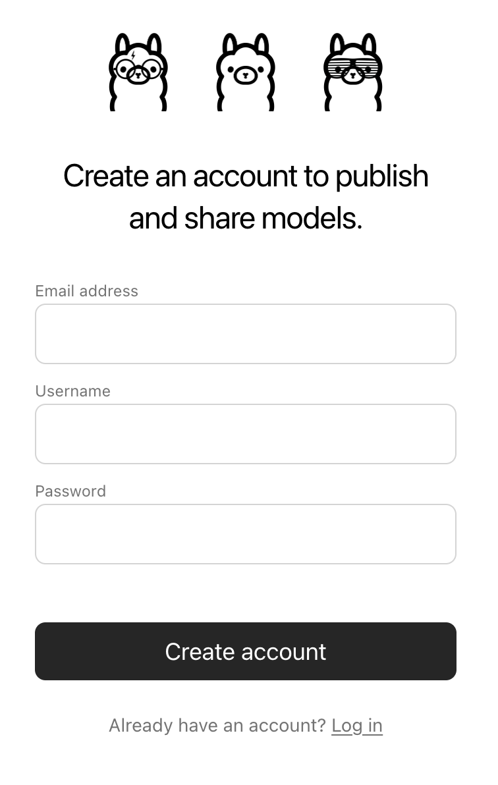
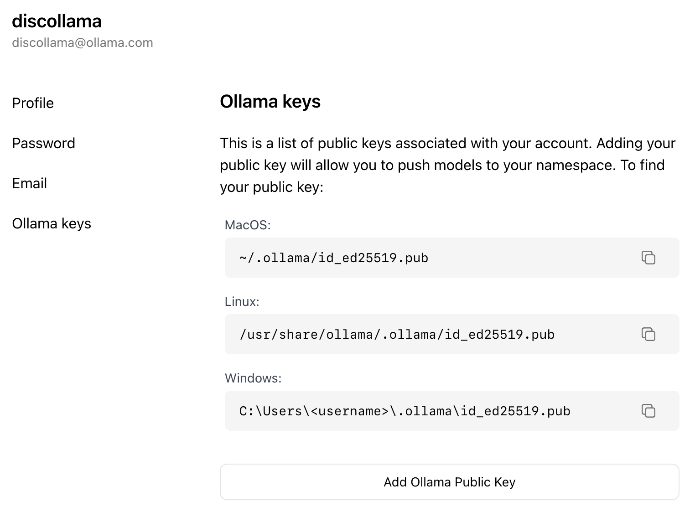

# Importing a model

You can import a model or fine tuned adapter into Ollama:

  * from Safetensors weights; or

  * from a GGUF file

## Importing a fine tuned adapter from Safetensors weights

First, create a `Modelfile` with a `FROM` command pointing at the base model you used for fine tuning, and an `ADAPTER` command which points to the directory with your Safetensors adapter:

```dockerfile
FROM <base model name>
ADAPTER /path/to/safetensors/adapter/directory
```

Make sure that you use the same base model in the `FROM` command as you used to create the adapter otherwise you will get erratic results. Most frameworks use different quantization methods, so it's best to use non-quantized (i.e. non-QLoRA) adapters. If your adapter is in the same directory as your `Modelfile`, use `ADAPTER .` to specify the adapter path.

Now run `ollama create` from the directory where the `Modelfile` was created:

```bash
ollama create my-model
```

Lastly, test the model:

```bash
ollama run my-model
```

Ollama supports importing adapters based on several different model architectures including:

  * Llama (including Llama 2, Llama 3, and Llama 3.1);
  * Mistral (including Mistral 1, Mistral 2, and Mixtral); and
  * Gemma (including Gemma 1 and Gemma 2)

You can create the adapter using a fine tuning framework or tool which can output adapters in the Safetensors format, such as:

  * Hugging Face [fine tuning framework] (https://huggingface.co/docs/transformers/en/training)
  * [Unsloth](https://github.com/unslothai/unsloth)
  * [MLX](https://github.com/ml-explore/mlx)


## Importing a model from Safetensors weights

First, create a `Modelfile` with a `FROM` command which points to the directory containing your Safetensors weights:

```dockerfile
FROM /path/to/safetensors/directory
```

If you create the Modelfile in the same directory as the weights, you can use the command `FROM .`.

Now run the `ollama create` command from the directory where you created the `Modelfile`:

```shell
ollama create my-model
```

Lastly, test the model:

```shell
ollama run my-model
```

Ollama supports importing models for several different architectures including:

  * Llama (including Llama 2, Llama 3, and Llama 3.1);
  * Mistral (including Mistral 1, Mistral 2, and Mixtral);
  * Gemma (including Gemma 1 and Gemma 2); and
  * Phi3

This includes importing foundation models as well as any fine tuned models which which have been _fused_ with a foundation model.


## From a GGUF based model

If you have a GGUF based model or adapter it is possible to import it into Ollama. You can obtain a GGUF model or adapter by:

  * converting a Safetensors model with the `convert_hf_to_gguf.py` from Llama.cpp; 

  * converting a Safetensors adapter with the `convert_lora_to_gguf.py` from Llama.cpp; or

  * downloading a model or adapter from a place such as HuggingFace

To import a GGUF model, create a `Modelfile` containg:

```dockerfile
FROM /path/to/file.gguf
```

For a GGUF adapter, create the `Modelfile` with:

```dockerfile
FROM <model name>
ADAPTER /path/to/file.gguf
```

When importing a GGUF adapter, it's important to use the same base model as the base model that the adapter was created with. You can use:

 * a model from Ollama

 * a GGUF file

 * a Safetensors based model 


## Quantizing a Model

Quantizing a model allows you to run models faster and with less memory consumption but at reduced accuracy. This allows you to run a model on more modest hardware.

Ollama can quantize FP16 and FP32 based models into different quantization levels using the `-q/--quantize` flag with the `ollama create` command.

### Supported Quantizations

- `Q4_0`
- `Q4_1`
- `Q5_0`
- `Q5_1`
- `Q8_0`

#### K-means Quantizations

- `Q3_K_S`
- `Q3_K_M`
- `Q3_K_L`
- `Q4_K_S`
- `Q4_K_M`
- `Q5_K_S`
- `Q5_K_M`
- `Q6_K`

First, create a Modelfile with the FP16 or FP32 based model you wish to quantize.

```dockerfile
FROM /path/to/my/gemma/f16/model
```

Use `ollama create` to then create the quantized model.

```shell
$ ollama create -q Q4_K_M mymodel
transferring model data
quantizing F16 model to Q4_K_M
creating new layer sha256:735e246cc1abfd06e9cdcf95504d6789a6cd1ad7577108a70d9902fef503c1bd
creating new layer sha256:0853f0ad24e5865173bbf9ffcc7b0f5d56b66fd690ab1009867e45e7d2c4db0f
writing manifest
success
```

## Sharing your model on [ollama.com](https://ollama.com)

You can share any model you have created by pushing it to [ollama.com](https://ollama.com) so that other users can try it out.

First, use your browser to go to the [Ollama Sign-Up](https://ollama.com/signup) page. If you already have an account, you can skip this step.



The `Username` field will be used as part of your model's name (e.g. `jmorganca/mymodel`), so make sure you are comfortable with the username that you have selected.

Now that you have created an account and are signed-in, go to the [Ollama Keys Settings](https://ollama.com/settings/keys) page.

Follow the directions on the page to determine where your Ollama Public Key is located.



Click on the `Add Ollama Public Key` button, and copy and paste the contents of your Ollama Public Key into the text field.

To push a model to [ollama.com](https://ollama.com), first make sure that it is named correctly with your username. You may have to use the `ollama cp` command to copy
your model to give it the correct name. Once you're happy with your model's name, use the `ollama push` command to push it to [ollama.com](https://ollama.com).

```shell
ollama cp mymodel myuser/mymodel
ollama push myuser/mymodel
```

Once your model has been pushed, other users can pull and run it by using the command:

```shell
ollama run myuser/mymodel
```

